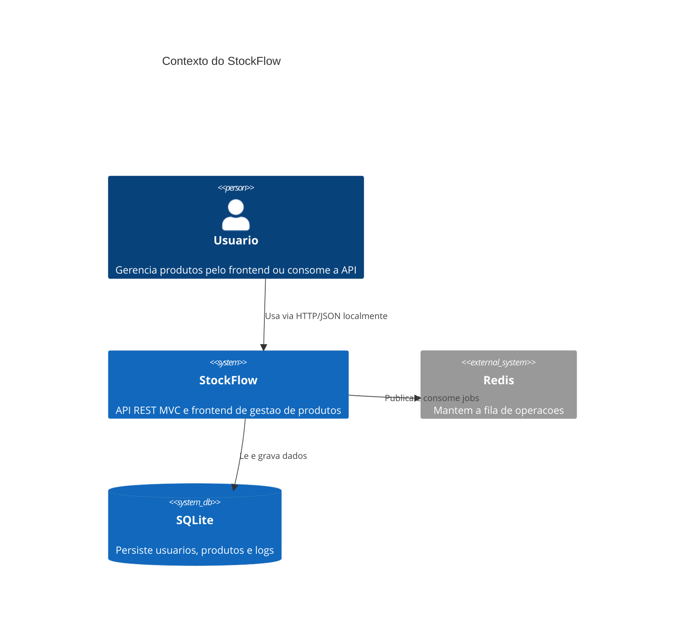
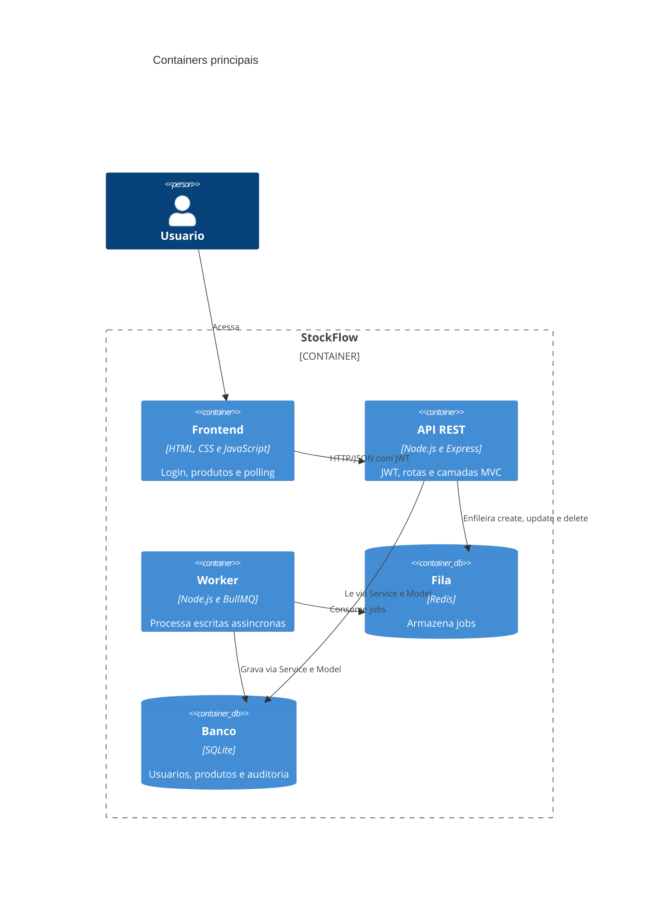
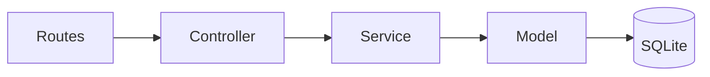
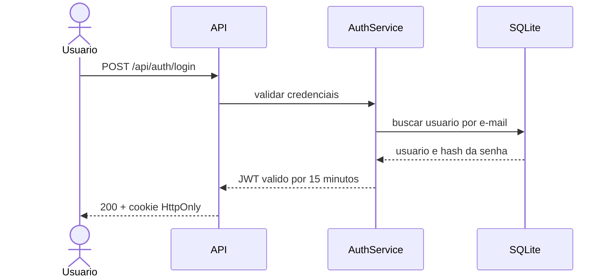
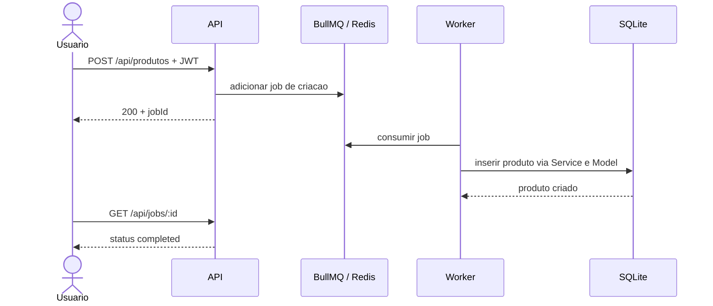
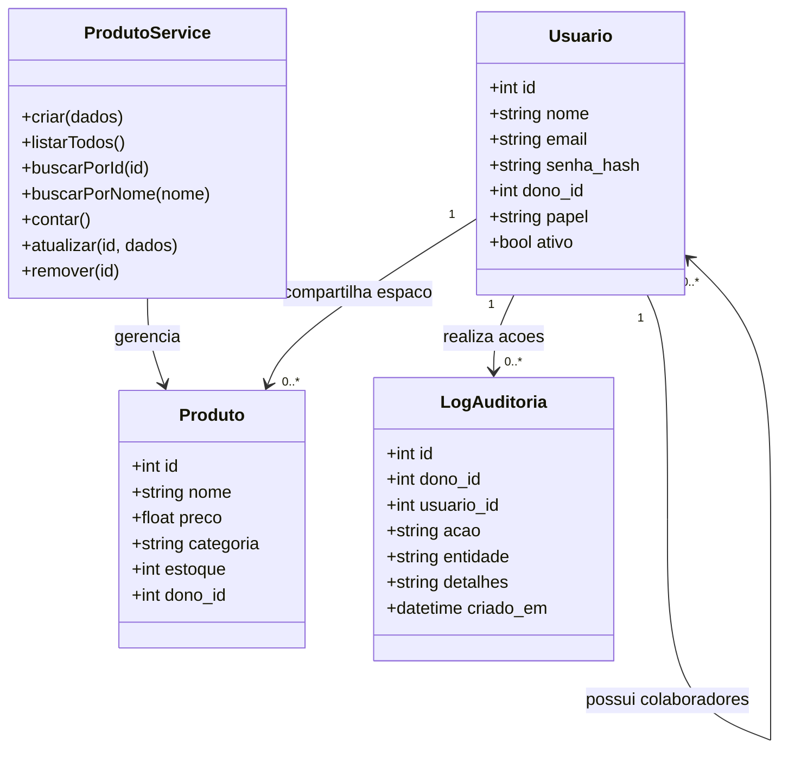

# Arquitetura - API REST de Produtos

Os diagramas usam Mermaid e sao renderizados diretamente pelo GitHub. O foco
e mostrar a solucao de forma simples: uma API MVC protegida por autenticacao e
uma fila para processar alteracoes nos produtos.

## 1. C4 - Contexto

## 2. C4 - Containers e componentes

Dentro da API, as responsabilidades seguem o MVC com uma camada de servico:

- **Routes:** define os endpoints e aplica a autenticacao.
- **Controller:** recebe a requisicao e monta a resposta HTTP.
- **Service:** concentra validacoes e regras de negocio.
- **Model:** executa o acesso ao SQLite.

## 3. Sequencia - Login

## 4. Sequencia - Criacao assincrona

As consultas (`find all`, `find by id`, `find by name` e `count`) sao
sincronas. Criacao, atualizacao e exclusao sao enviadas para a fila e
acompanhadas pelo frontend por polling. Proprietarios e colaboradores usam o
mesmo espaco de produtos, identificado pelo proprietario. Cada alteracao gera
um log com usuario, acao, entidade e horario.

## 5. Dominio

Em producao, HTTPS deve ser terminado por um proxy reverso ou pela plataforma
de hospedagem. O JWT expira em 15 minutos e e enviado pelo frontend em cookie
`HttpOnly` com `SameSite=Strict`.
