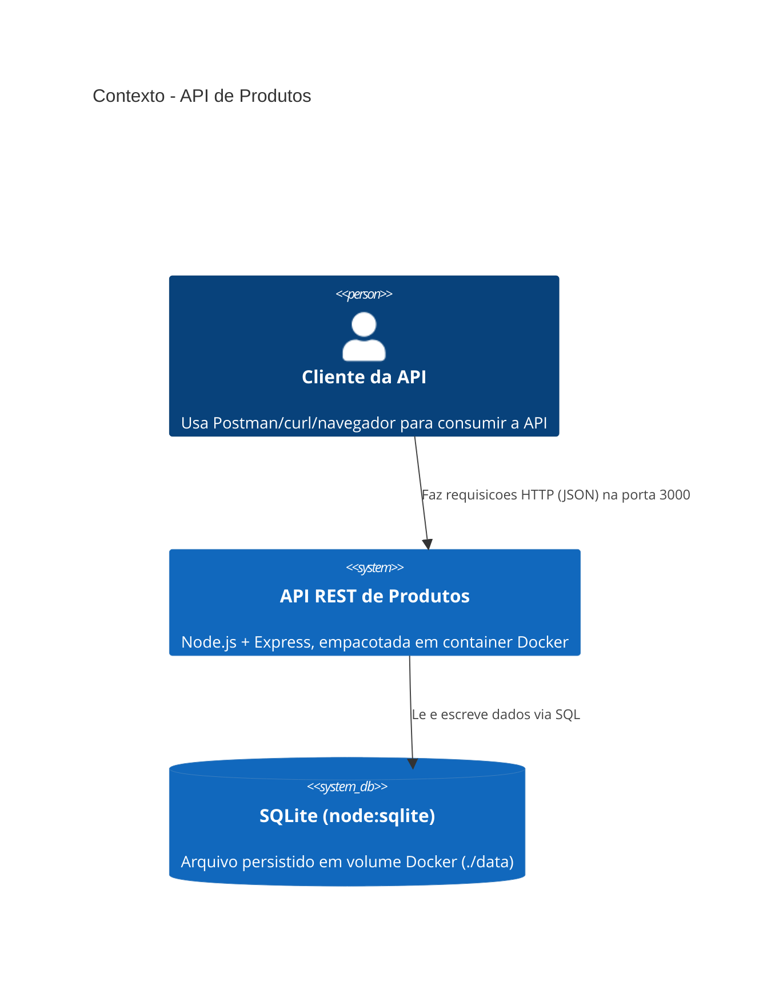
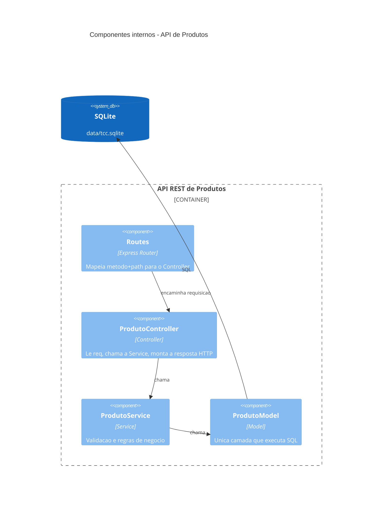
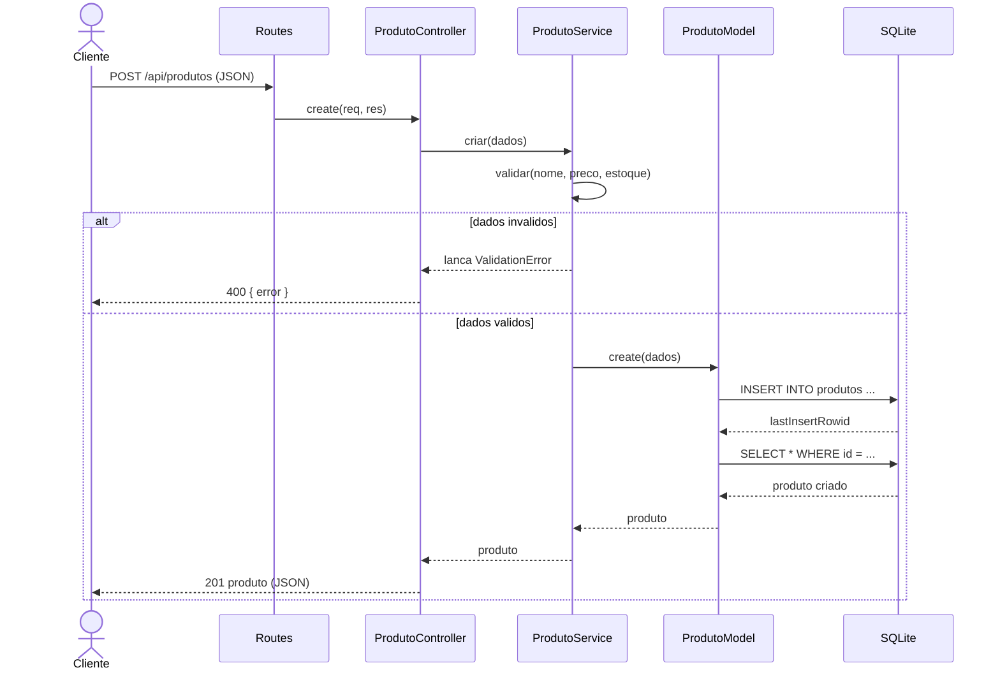
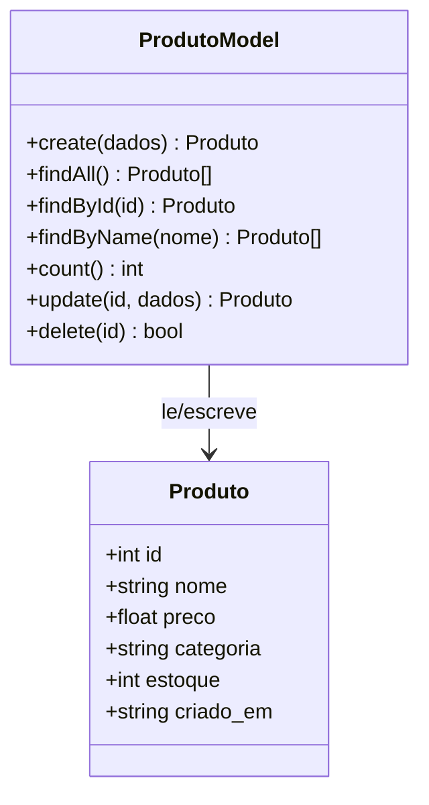

# Arquitetura — API REST de Produtos (MVC)

Diagramas em [Mermaid](https://mermaid.js.org/), renderizados nativamente pelo
GitHub. Cobrem o requisito de desenho arquitetural (C4 + UML) do exercício.

## 1. C4 — Contexto

Visão de fora: quem usa o sistema e com o que ele conversa.

## 2. C4 — Componentes (dentro da API)

Visão interna: como a requisição atravessa as camadas MVC + Service.

## 3. Sequência — `POST /api/produtos`

## 4. Diagrama de classes — Model

## Por que essas camadas

- **Model** isola todo acesso a dados: se o banco mudar (ex.: Postgres), só o
  Model muda.
- **Service** concentra a regra de negócio (validação) fora do HTTP — pode ser
  reaproveitada por outro tipo de entrada (ex.: um job, uma CLI) sem duplicar
  código.
- **Controller** só traduz HTTP: não tem SQL nem regra de negócio.
- **Routes** é a única camada que conhece os paths da API.
